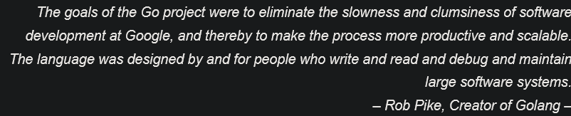
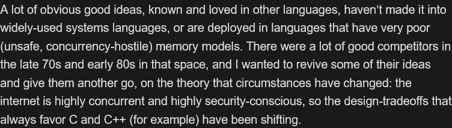
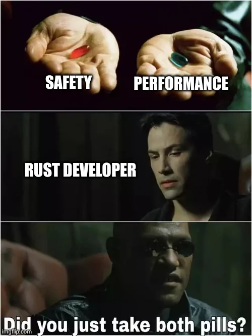
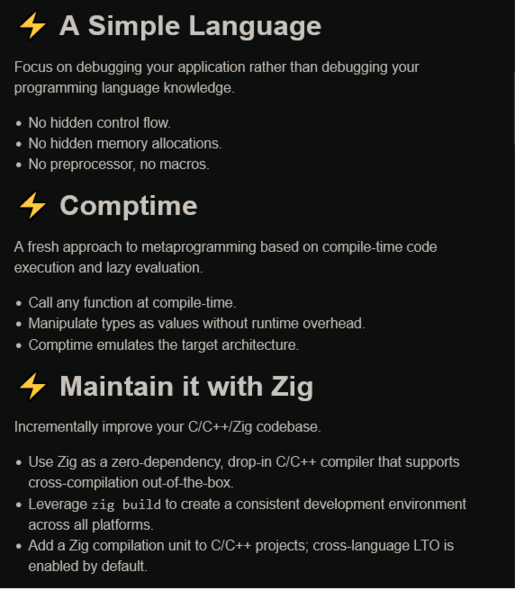
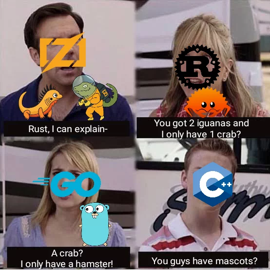

## New kids on the block!

Recent programming languages and  
problems they solve and bring
  

Marcin Dąbrowski

2023-12-06

---

### feel free to follow along

  
https://mardab.github.io/UJIPP

---

### Introductory warmup

### meme 
<!-- .element: class="fragment" -->
---
### Google Golang

---

### Goals of Golang

development goals

* unused dependencies are errors
<!-- .element: class="fragment" -->

* dependencies are precompiled into objects, export-first
<!-- .element: class="fragment" -->

* acyclic dependency graphs
<!-- .element: class="fragment" -->

* one package system for  
libraries/namespaces/modules
<!-- .element: class="fragment" -->

* coroutines for parallelism and asynchrony
<!-- .element: class="fragment" -->

* memory-safe automatic garbage collection 
<!-- .element: class="fragment" -->
---

### Goals of Golang

syntax goals

* only 25 keywords, less than C/C++
<!-- .element: class="fragment" -->

* dynamic-like type inference
<!-- .element: class="fragment" -->

* no generics*
<!-- .element: class="fragment" -->

* simple, named type system
<!-- .element: class="fragment" -->

* no pointer arithmetics, implicit numeric conversions, expression assignment, etc.
<!-- .element: class="fragment" -->

* composition over inheritance
<!-- .element: class="fragment" -->

---

### Uses of Golang

* Cloud tools and services  
(GCP, Docker, Kubernetes, Caddy, CockroachDB)
<!-- .element: class="fragment" -->

* Single-binary CLI applications  
(Hugo, GitHub, MongoDB Atlas, Mattermost)
<!-- .element: class="fragment" -->

* Development operations utilities  
(etcd, Terraform, Prometheus, OpenTelemetry)
<!-- .element: class="fragment" -->

---

### Problem(s) with Golang

<iframe title="I want off Mr. Golang's Wild Ride" frameborder="0" width="100%" height="600px" data-src="https://fasterthanli.me/articles/i-want-off-mr-golangs-wild-ride"></iframe>

---

### Rust 

 — Graydon Hoare, 2012 

---

### Goals of Rust

* memory safety enforced at compilation  
(reference counting with RAII instead of GC)
<!-- .element: class="fragment" -->

* zero-cost abstractions  
(zero-copy implementations, static dispatch with trait objects, monomorphization)
<!-- .element: class="fragment" -->

* well-implemented modern features  
(generics, traits, mixins, macroprogramming)
<!-- .element: class="fragment" -->

* being a systems-programming language  
(optional exclusion of standard library, C-representation FFI, inline assembly*)
<!-- .element: class="fragment" -->

---

---

### Uses of Rust

augmenting existing software systems  

* Firefox Oxidation - rewrite of Gecko components
<!-- .element: class="fragment" -->

* npm - authorization service for javascript packages registry
<!-- .element: class="fragment" -->

* Linux - kernel module creation support, mainline since 6.1
<!-- .element: class="fragment" -->

---

### Uses of Rust

high-performance CLI tools

* ripgrep - recursive line search with filtering
<!-- .element: class="fragment" -->

* Starship - shell-agnostic custom prompt
<!-- .element: class="fragment" -->

* Dust - more intuitive disk usage statistics
<!-- .element: class="fragment" -->

* tokei - code statistics generator
<!-- .element: class="fragment" -->

* Zoxide - cd with pattern matching and heruristics
<!-- .element: class="fragment" -->

* fastmod - interactive codebase refactorer  
<!-- .element: class="fragment" -->

---

### Uses of Rust

graphical applications

* Alacritty - modern terminal emulator
<!-- .element: class="fragment" -->

* Servo - experimental browser engine
<!-- .element: class="fragment" -->

* Piston/Amethyst/ggez/Bevy - game engines/frameworks
<!-- .element: class="fragment" -->

* Czkawka - high-performance duplicate finder
<!-- .element: class="fragment" -->

* COSMIC(-epoch) - System76's replacement for GNOME-based shell
<!-- .element: class="fragment" -->

---

### Uses of Rust

low-level software

* Redox - the most complete operating system written in Rust
(>97% of kernel in pure Rust, custom POSIX libc, windowing/compositing, *nix compatibility)
<!-- .element: class="fragment" -->

* Tock/Hubris/Drone - Rust RTOSs for microcontrollers
<!-- .element: class="fragment" -->

* Ferrocene - functional safety-critical forkless Rust toolchain
(ISO 26262 and IEC 61508 qualified on November 8)
<!-- .element: class="fragment" -->

---

### Uses of Rust

web applications

* Drill - lightweight HTTP load tester
<!-- .element: class="fragment" -->

* Diesel - multi-dialect SQL query builder and ORM library
<!-- .element: class="fragment" -->

* Revolt, Lemmy - open source Discord, Reddit substitutes
<!-- .element: class="fragment" --> 

* Kata Containers 2 - runtime for lightweight VMs as containers
<!-- .element: class="fragment" -->

---

### The big ~~one~~ RIIR

<iframe title="Why Discord is switching from Go to Rust" allowtransparency="true" style="background: #FFFFFF;" frameborder="0" width="100%" height="600px" data-src="http://frogfind.com/read.php?a=https%3A%2F%2Fdiscord.com%2Fblog%2Fwhy%2Ddiscord%2Dis%2Dswitching%2Dfrom%2Dgo%2Dto%2Drust&rut=8099e06061aa77949f3bb32e70e0f657752f79f1a6481d4c17b9c42a9a94810a"></iframe>

---

### No rose without thorns

<iframe title="Why I rewrote my Rust keyboard firmware in Zig: consistency, mastery, and fun" frameborder="0" width="100%" height="600px" src="https://kevinlynagh.com/rust-zig/"></iframe>

---

### Zig

---

### Uses of Zig

* Bun - fastest npm-compatible JavaScript bundler/runtime
<!-- .element: class="fragment" -->

* Uber's Hermetic CC - small C/C++/Go cross-compilation toolchain
<!-- .element: class="fragment" -->

* MicroZig - unified abstraction for embedded development
<!-- .element: class="fragment" -->

---

### THE END

<!-- .element: class="fragment" -->

---

### Sources (1/6)

* https://github.com/mkrl/misbrands
* https://go.dev/talks/2012/splash.article
* https://go.dev/solutions/
* https://cloud.google.com/go
* https://www.docker.com/community/open-source/
* https://github.com/kubernetes/kubernetes
* https://caddyserver.com/docs/
* https://github.com/cockroachdb/cockroach
* https://github.com/gohugoio/hugo
* https://github.com/cli/cli

---

### Sources (2/6)

* https://github.com/mongodb/mongodb-atlas-cli
* https://github.com/mattermost/mmctl
* https://github.com/etcd-io/etcd
* https://github.com/hashicorp/terraform
* https://github.com/prometheus/prometheus
* https://github.com/open-telemetry/opentelemetry-go
* https://fasterthanli.me/articles/i-want-off-mr-golangs-wild-ride
* https://techrepublic.com/article/rust-not-firefox-is-mozillas-greatest-industry-contribution/

---

### Sources (3/6)

* https://old.reddit.com/r/rustjerk/comments/1817fts
* https://4e6.github.io/firefox-lang-stats/
* https://www.rust-lang.org/static/pdfs/Rust-npm-Whitepaper.pdf
* https://lwn.net/Articles/910762/
* https://github.com/BurntSushi/ripgrep
* https://starship.rs/
* https://github.com/bootandy/dust
* https://github.com/XAMPPRocky/tokei
* https://github.com/ajeetdsouza/zoxide
* https://github.com/facebookincubator/fastmod

---

### Sources (4/6)

* https://alacritty.org/
* https://servo.org/
* https://www.piston.rs/
* https://amethyst.rs/
* https://ggez.rs/
* https://bevyengine.org/
* https://github.com/qarmin/czkawka
* https://github.com/pop-os/cosmic-epoch
* https://redox-os.org/
* https://tockos.org/
* https://github.com/oxidecomputer/hubris

---

### Sources (5/6)

* https://www.drone-os.com/
* https://ferrous-systems.com/blog/officially-qualified-ferrocene/
* https://github.com/fcsonline/drill
* https://diesel.rs/
* https://github.com/revoltchat/backend
* https://github.com/LemmyNet/lemmy
* https://github.com/kata-containers/kata-containers
* https://discord.com/blog/why-discord-is-switching-from-go-to-rust
* https://kevinlynagh.com/rust-zig/

---

### Sources (6/6)

* https://ziglang.org/
* https://bun.sh/
* https://www.uber.com/en-US/blog/bootstrapping-ubers-infrastructure-on-arm64-with-zig/
* https://github.com/ZigEmbeddedGroup/microzig
* https://old.reddit.com/r/ProgrammerHumor/comments/qx9dkv/

---

<!-- dev run: reveal-md slides.md  --watch --theme moon --disable-auto-open -->